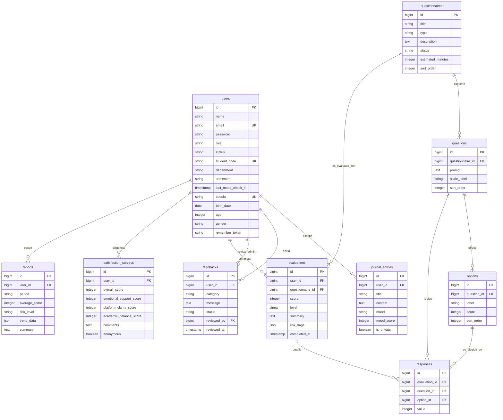
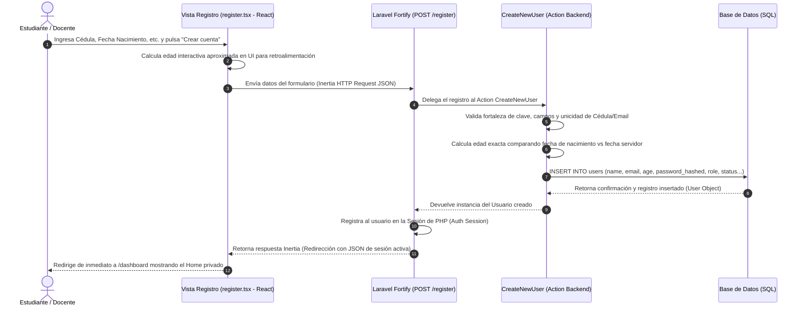
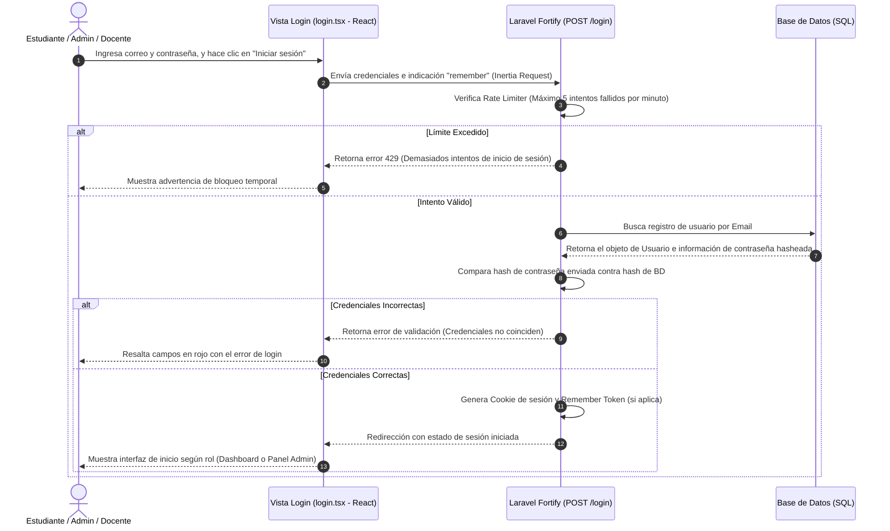
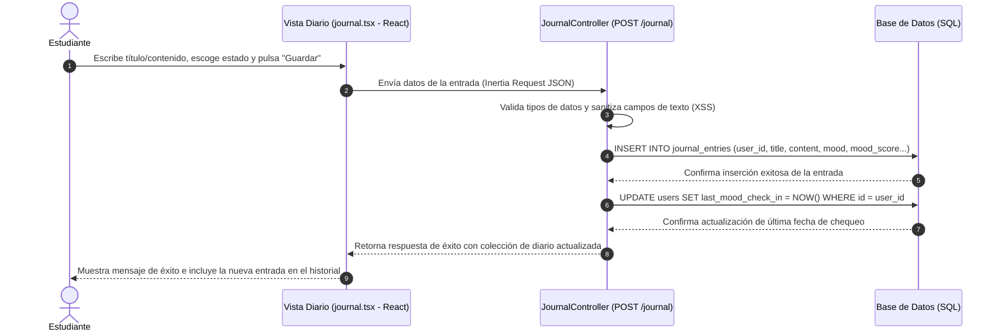
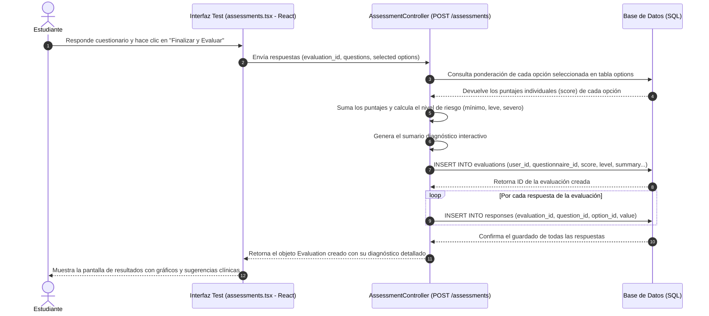
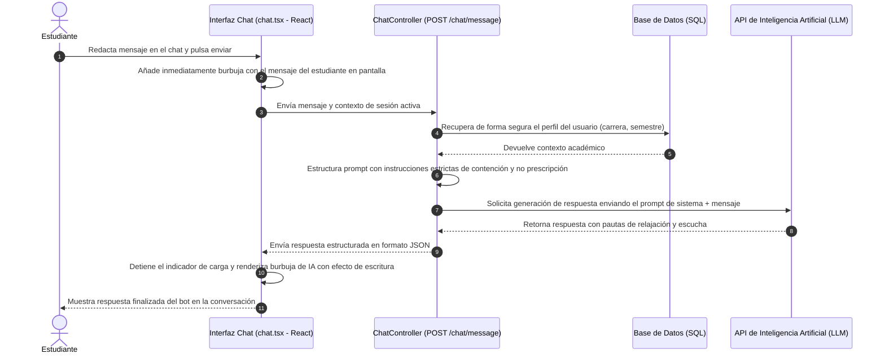

# Especificación de Casos de Uso, Modelo Entidad-Relación (MER) y Arquitectura Técnica del Sistema

Este documento contiene la especificación completa del sistema, detallando el catálogo exhaustivo de **Actores del Sistema**, el **Diagrama de Casos de Uso (CU)** general, el desglose de los Casos de Uso con sus flujos, precondiciones y postcondiciones, la definición del **Modelo Entidad-Relación (MER)** con su diagrama visual en Mermaid, y los **Diagramas de Secuencia** para los flujos principales.

---

## 1. Actores del Sistema

El sistema identifica tres roles bien diferenciados que interactúan con las distintas capas funcionales:

*   **Estudiante / Usuario Regular:** Persona que hace uso del portal para registrar su estado emocional en el diario, conversar con el chat con IA, realizar pruebas de bienestar mental, consultar recursos educativos y reportar sugerencias.
*   **Docente / Profesor:** Persona que puede registrarse con perfiles de apoyo, participar en dinámicas institucionales o emitir feedbacks (sugerencias académicas).
*   **Administrador de Bienestar:** Usuario de nivel técnico/psicólogo que gestiona el banco de preguntas de los cuestionarios, revisa el buzón de sugerencias de los estudiantes, monitorea las alertas de riesgo y administra el estado de los usuarios de la plataforma.

---

## 2. Diagrama de Caso de Uso

El diagrama de casos de uso representa las principales interacciones entre los actores del sistema y las funcionalidades disponibles. Se identifican tres actores principales: el Estudiante, el Docente (usuarios directos de la plataforma) y el Administrador de Bienestar, encargado de la gestión y supervisión del sistema.

A continuación se expone el mapeo general de casos de uso representados textualmente en formato jerárquico estructurado:

```mermaid
graph TD
    %% Actores
    subgraph Actores
        E["Estudiante / Usuario"]
        D["Docente / Profesor"]
        A["Administrador de Bienestar"]
    end

    %% Casos de Uso del Módulo de Seguridad
    subgraph Módulo de Seguridad y Cuenta
        UC01("CU-01: Registrar Cuenta")
        UC02("CU-02: Iniciar Sesión (Clave / Passkey)")
        UC03("CU-03: Administrar Perfil y Apariencia")
    end

    %% Módulo Diario
    subgraph Módulo de Diario Emocional
        UC04("CU-04: Registrar Entrada Diario")
        UC05("CU-05: Modificar / Eliminar Entrada")
    end

    %% Módulo Asistente IA
    subgraph Módulo Asistente IA
        UC06("CU-06: Conversar con Chat IA")
    end

    %% Módulo Evaluaciones
    subgraph Módulo de Autoevaluaciones
        UC07("CU-07: Responder Test de Bienestar")
        UC08("CU-08: Consultar Historial y Gráficos")
    end

    %% Módulo Sugerencias y Encuestas
    subgraph Módulo de Retroalimentación
        UC09("CU-09: Enviar Sugerencia al Buzón")
        UC10("CU-10: Diligenciar Encuesta de Satisfacción")
    end

    %% Módulo Administración
    subgraph Módulo de Administración
        UC11("CU-11: Gestionar Usuarios")
        UC12("CU-12: Gestionar Banco de Cuestionarios")
        UC13("CU-13: Revisar Buzón de Sugerencias")
    end

    %% Relaciones
    E --> UC01
    E --> UC02
    E --> UC03
    E --> UC04
    E --> UC05
    E --> UC06
    E --> UC07
    E --> UC08
    E --> UC09
    E --> UC10

    D --> UC01
    D --> UC02
    D --> UC03
    D --> UC09
    D --> UC10

    A --> UC02
    A --> UC11
    A --> UC12
    A --> UC13
```

---

## 3. Especificación Detallada de Casos de Uso

A continuación se presenta la lista completa y formal de todos los Casos de Uso que componen el sistema:

---

### Módulo I: Seguridad, Autenticación y Perfil

#### **CU-01: Registrar Cuenta de Usuario**
*   **Actor Principal:** Estudiante / Docente.
*   **Descripción:** Permite a una persona no registrada crear una cuenta en el sistema ingresando datos académicos, personales y credenciales.
*   **Precondiciones:** La persona debe estar en el portal público de registro y no tener una sesión activa. El correo y la cédula no deben existir en el sistema.
*   **Flujo Principal:**
    1. El usuario accede a la pantalla de registro (`register.tsx`).
    2. El sistema solicita: Cédula, Nombre Completo, Correo Electrónico, Contraseña, Fecha de Nacimiento, Sexo, Tipo de Rol (Estudiante o Docente), Carrera y Semestre (este último habilitado únicamente si el rol seleccionado es Estudiante).
    3. El usuario completa los campos. El frontend calcula y muestra de forma interactiva la edad estimada para propósitos visuales.
    4. El usuario hace clic en "Crear cuenta".
    5. La interfaz envía una petición `POST /register` al backend de Laravel Fortify.
    6. El backend valida que la contraseña cumpla con las políticas de complejidad, que los campos requeridos estén llenos y que la cédula y correo sean únicos.
    7. La acción `CreateNewUser` calcula con precisión matemática la edad actual en base a la fecha de nacimiento y la fecha del servidor.
    8. El backend crea el registro del usuario con estado `active` en la base de datos e inicia automáticamente la sesión.
    9. El sistema redirige al usuario a la página de inicio interna (`/dashboard`).
*   **Postcondiciones:** La cuenta de usuario es creada satisfactoriamente con la contraseña debidamente encriptada (hashing) y se genera una sesión de navegación activa para el usuario.

#### **CU-02: Iniciar Sesión**
*   **Actor Principal:** Estudiante / Docente / Administrador.
*   **Descripción:** Permite a un usuario registrado acceder de manera segura a su espacio de trabajo utilizando credenciales tradicionales (correo/contraseña) o una llave de seguridad (Passkey).
*   **Precondiciones:** El usuario debe estar en la pantalla de Login y poseer una cuenta de usuario activa.
*   **Flujo Principal:**
    1. El usuario accede a la pantalla de inicio de sesión (`login.tsx`).
    2. El sistema presenta dos vías: Ingresar Correo y Contraseña, o bien, autenticar mediante Llave de Acceso (Passkey).
    3. **Subflujo A (Credenciales tradicionales):**
        * El usuario ingresa Correo, Contraseña y marca opcionalmente "Recordarme".
        * El usuario hace clic en "Iniciar sesión".
        * El sistema valida las credenciales a través del controlador de sesión de Laravel Fortify (aplicando control de intentos/Rate Limiter).
    4. **Subflujo B (Autenticación por Passkey):**
        * El usuario hace clic en "Iniciar sesión con llave de acceso".
        * El sistema interactúa con el llavero del dispositivo cliente a través de WebAuthn.
        * El navegador provee la firma criptográfica correspondiente a la llave previamente registrada.
        * El servidor valida la firma criptográfica en la tabla `passkeys`.
    5. Si el proceso es exitoso, el sistema inicia la sesión de usuario.
    6. Se redirige al panel según el rol (Panel del Administrador o Dashboard del Estudiante).
*   **Postcondiciones:** El usuario tiene acceso a los módulos privados de la plataforma bajo una sesión protegida.

#### **CU-03: Administrar Perfil y Apariencia**
*   **Actor Principal:** Estudiante / Docente.
*   **Descripción:** Permite a un usuario autenticado modificar su información básica de perfil o ajustar la apariencia visual de la aplicación (Modo Claro/Oscuro/Sistema).
*   **Precondiciones:** El usuario debe estar autenticado.
*   **Flujo Principal:**
    1. El usuario navega a la sección de Configuración de Perfil (`settings/profile` o `settings/appearance`).
    2. El sistema muestra sus datos actuales precargados y un panel de cambio de contraseña.
    3. El usuario puede cambiar su Nombre, Correo o Carrera y guardar. El backend valida los nuevos campos y los actualiza en la base de datos.
    4. Para la apariencia, el usuario selecciona una de las opciones: Claro (Light), Oscuro (Dark) o Sistema. El frontend procesa la selección agregando/removiendo la clase `dark` de Tailwind/CSS en el elemento raíz HTML de inmediato.
*   **Postcondiciones:** La base de datos guarda los datos actualizados y el cliente almacena las preferencias de interfaz para futuras visitas.

---

### Módulo II: Diario Emocional y Auto-monitoreo

#### **CU-04: Registrar Entrada en Diario Emocional**
*   **Actor Principal:** Estudiante.
*   **Descripción:** Permite al estudiante registrar un escrito íntimo expresando su situación emocional diaria y asociando un estado de ánimo con su respectiva puntuación.
*   **Precondiciones:** El usuario debe estar autenticado como Estudiante.
*   **Flujo Principal:**
    1. El usuario accede a la sección "Diario Emocional" (`journal.tsx`).
    2. El sistema muestra el formulario para redactar una nueva entrada.
    3. El usuario ingresa un Título, selecciona un Estado de Ánimo (ej: Alegre, Ansioso, Triste, Sereno), asigna una calificación de intensidad numérica (1-10) y escribe la Nota/Reflexión.
    4. El usuario decide si la entrada es Privada (por defecto) o si desea compartirla.
    5. El usuario hace clic en "Guardar Entrada".
    6. La interfaz envía una petición `POST /journal` al controlador `JournalController`.
    7. El controlador valida los datos, sanitiza el texto y crea una nueva fila en `journal_entries` referenciando el `user_id`.
    8. El sistema actualiza el campo `last_mood_check_in` en la tabla del usuario con la marca de tiempo actual.
*   **Postcondiciones:** El diario emocional almacena la nueva entrada de manera permanente e histórica para monitoreo clínico.

#### **CU-05: Modificar / Eliminar Entrada de Diario**
*   **Actor Principal:** Estudiante.
*   **Descripción:** Permite al estudiante corregir el texto de una entrada previa de su diario emocional o borrarla de forma definitiva.
*   **Precondiciones:** El usuario debe ser el propietario legítimo de la entrada del diario (`user_id` de la sesión coincide con `user_id` del registro).
*   **Flujo Principal:**
    1. El estudiante visualiza el listado cronológico de sus notas emocionales.
    2. Hace clic en "Editar" o "Eliminar" en una de las tarjetas correspondientes.
    3. **Si es Editar:** El sistema carga la nota en un formulario interactivo. El usuario realiza los ajustes y el sistema despacha una solicitud `PATCH /journal/{entry}` que actualiza el registro en base de datos.
    4. **Si es Eliminar:** El sistema despliega una alerta de confirmación. Al aceptar, se despacha una solicitud `DELETE /journal/{entry}` que ejecuta un borrado físico en base de datos.
*   **Postcondiciones:** El diario es actualizado o la entrada eliminada, reflejando el cambio al instante.

---

### Módulo III: Chat y Asistente con Inteligencia Artificial

#### **CU-06: Interactuar con Asistente Emocional (Chat con IA)**
*   **Actor Principal:** Estudiante.
*   **Descripción:** Permite al estudiante conversar de forma interactiva con un bot inteligente configurado para ofrecer contención emocional, pautas de afrontamiento y escucha activa.
*   **Precondiciones:** El estudiante debe estar logueado y disponer de conexión activa.
*   **Flujo Principal:**
    1. El usuario ingresa a la pestaña "Chat de Apoyo" (`chat.tsx`).
    2. El sistema muestra la interfaz de conversación con el historial local.
    3. El usuario redacta un mensaje en la barra inferior (ej: *"Me siento muy estresado por los parciales de Ingeniería de Sistemas"*) y pulsa enviar.
    4. La interfaz de React añade inmediatamente la burbuja del mensaje del usuario y envía la petición `POST /chat/message` con el texto.
    5. El controlador `ChatController` recibe el mensaje del usuario, recupera el contexto de su perfil (carrera, semestre, últimas notas del diario de forma anónima y protegida si aplica) y hace una llamada segura mediante API al modelo de Lenguaje de Inteligencia Artificial.
    6. La IA procesa el mensaje bajo lineamientos estrictos de contención psicológica escolar, sin emitir recetas médicas pero brindando metodologías de relajación.
    7. El servidor recibe la respuesta de la IA y la retorna en formato JSON al cliente.
    8. El frontend muestra la burbuja de respuesta con una micro-animación fluida de escritura.
*   **Postcondiciones:** La conversación queda registrada temporal o históricamente en la interfaz y el estudiante recibe pautas de afrontamiento inmediatas.

---

### Módulo IV: Diagnóstico, Tests y Evaluaciones de Bienestar

#### **CU-07: Responder Test de Bienestar Psicológico**
*   **Actor Principal:** Estudiante.
*   **Descripción:** Permite al estudiante resolver cuestionarios interactivos psicométricos que evalúan su nivel de ansiedad, depresión, equilibrio académico y estrés general.
*   **Precondiciones:** El estudiante tiene la sesión iniciada y existen cuestionarios activos creados en el sistema por el administrador.
*   **Flujo Principal:**
    1. El estudiante navega a "Evaluaciones" (`assessments.tsx`).
    2. El sistema lista los cuestionarios disponibles con información relevante (Tiempo estimado de resolución, tipo y descripción).
    3. El estudiante hace clic en "Iniciar Test".
    4. Se le presentan las preguntas una a una o en un formulario de cuadrícula donde selecciona opciones de escalas tipo Likert.
    5. Al responder todas las preguntas, el estudiante hace clic en "Finalizar y Evaluar".
    6. El frontend envía un JSON estructurado con las respuestas a `POST /assessments`.
    7. El controlador `AssessmentController` calcula los puntajes acumulados según las ponderaciones registradas para cada opción elegida (`score` de la tabla `options`).
    8. El backend determina un nivel resultante (ej: Ansiedad Severa, Ansiedad Leve, Estable).
    9. Almacena el resultado general en la tabla `evaluations` y guarda cada una de las respuestas individuales en la tabla `responses` para su desglose.
    10. El sistema presenta al estudiante una pantalla estilizada con sus resultados, análisis clínico resumido y recomendaciones institucionales.
*   **Postcondiciones:** Se crea una nueva evaluación terminada y respuestas asociadas en la base de datos, sirviendo de base para futuras alertas y diagnósticos.

#### **CU-08: Consultar Diagnósticos e Historial de Evaluaciones**
*   **Actor Principal:** Estudiante.
*   **Descripción:** Permite al estudiante visualizar sus evaluaciones previas en forma de línea de tiempo con gráficos para evaluar su mejoría o decaimiento emocional a lo largo del periodo académico.
*   **Precondiciones:** El estudiante debe haber completado al menos un test.
*   **Flujo Principal:**
    1. El estudiante entra a la sección "Reportes y Diagnósticos" (`reports.tsx`).
    2. El sistema renderiza un panel interactivo que contiene:
        * Tarjetas con el último test realizado e interpretaciones recomendadas.
        * Gráficos interactivos de líneas y barras con la evolución de puntuaciones de bienestar del estudiante.
    3. El usuario puede ver el desglose individual de cualquier test pasado haciendo clic en "Ver Detalles".
*   **Postcondiciones:** El estudiante visualiza con transparencia su progreso mental.

---

### Módulo V: Retroalimentación y Buzón de Sugerencias

#### **CU-09: Enviar Sugerencia o Retroalimentación Institucional**
*   **Actor Principal:** Estudiante / Docente.
*   **Descripción:** Permite enviar una sugerencia, queja o mensaje sobre el bienestar en la universidad, clasificándola en una categoría para ser atendida por los coordinadores.
*   **Precondiciones:** El usuario debe estar autenticado.
*   **Flujo Principal:**
    1. El usuario accede a la sección "Buzón / Feedback" (`feedback.tsx`).
    2. El sistema despliega un formulario.
    3. El usuario escoge una categoría (ej: "Infraestructura de Bienestar", "Atención Psicológica", "Clima de Aula", "Otros") y redacta un mensaje detallado de forma abierta.
    4. El usuario hace clic en "Enviar Sugerencia".
    5. El frontend envía la solicitud `POST /feedback`.
    6. El controlador `FeedbackController` valida el mensaje, guarda el registro en la tabla `feedbacks` asociando el ID del usuario y marcando el estado de la sugerencia como `pending`.
*   **Postcondiciones:** La sugerencia es guardada con éxito en espera de la revisión del Administrador de Bienestar.

#### **CU-10: Diligenciar Encuesta de Satisfacción General**
*   **Actor Principal:** Estudiante / Docente.
*   **Descripción:** Permite calificar de forma anónima o identificada la usabilidad de la plataforma de bienestar y el nivel de soporte emocional percibido.
*   **Precondiciones:** El usuario está logueado en la plataforma.
*   **Flujo Principal:**
    1. El usuario accede a la opción "Encuesta de Satisfacción" (`surveys.tsx`).
    2. El sistema presenta controles deslizantes o numéricos de 1 a 5 para calificar cuatro ejes fundamentales:
        * Satisfacción General de la Plataforma.
        * Calidad de Soporte Emocional.
        * Claridad de los Módulos.
        * Balance Académico Percibido.
    3. El usuario introduce comentarios adicionales opcionales y decide si marcar el envío como Anónimo mediante un checkbox.
    4. Envía el formulario a `POST /surveys`.
    5. `SurveyController` almacena el registro en la tabla `satisfaction_surveys`. Si seleccionó anónimo, guarda el ID del usuario como `null`.
*   **Postcondiciones:** Se consolida una encuesta que servirá a los directivos para medir el impacto de la herramienta.

---

### Módulo VI: Administración y Gestión de la Plataforma

#### **CU-11: Gestionar Usuarios (Foco de Seguridad y Roles)**
*   **Actor Principal:** Administrador de Bienestar.
*   **Descripción:** Permite suspender/activar usuarios, cambiar roles institucionales y supervisar a la comunidad estudiantil y docente registrada.
*   **Precondiciones:** El usuario de sesión debe poseer el rol de `admin`.
*   **Flujo Principal:**
    1. El administrador ingresa a "Administración > Usuarios" (`admin/users`).
    2. El sistema despliega la tabla con todos los usuarios registrados, mostrando su Cédula, Nombre, Correo, Rol (Student, Teacher, Admin), Fecha de Registro y Estado actual (active, suspended).
    3. **Subflujo A: Modificar Estado.** El administrador hace clic en el interruptor de estado. El sistema despacha `PATCH /admin/users/{userId}/status` alternando entre `active` y `suspended` para restringir el inicio de sesión.
    4. **Subflujo B: Modificar Rol.** El administrador selecciona un nuevo rol de un menú desplegable. Despacha `PATCH /admin/users/{userId}/role`.
    5. **Subflujo C: Eliminar de Forma Definitiva.** El administrador pulsa el botón de papelera. Se despacha `DELETE /admin/users/{userId}` eliminando físicamente el registro.
*   **Postcondiciones:** Los cambios en los perfiles tienen impacto inmediato sobre los privilegios de navegación del usuario afectado.

#### **CU-12: Gestionar Banco de Preguntas y Cuestionarios**
*   **Actor Principal:** Administrador de Bienestar.
*   **Descripción:** Permite diseñar nuevos tests de autodiagnóstico, modificar preguntas de bienestar y añadir las correspondientes puntuaciones Likert de respuesta.
*   **Precondiciones:** El administrador de bienestar tiene la sesión activa.
*   **Flujo Principal:**
    1. El administrador navega a "Cuestionarios" (`admin/questionnaires`).
    2. El sistema muestra la lista de cuestionarios actuales (en estado borrador, publicados, etc.).
    3. El administrador puede hacer clic en "Crear Cuestionario" definiendo su título (ej: "Escala de Estrés Académico SISCO"), tipo, descripción e insertar preguntas.
    4. Para cada pregunta, define el enunciado y las opciones, asignando a cada una un puntaje (ej: "Nunca" = 1, "Casi Siempre" = 4).
    5. Al guardar, se guardan los registros correspondientes en las tablas `questionnaires`, `questions` y `options` de forma sincronizada.
*   **Postcondiciones:** El cuestionario actualizado o nuevo queda disponible para que los estudiantes lo resuelvan.

#### **CU-13: Revisar Buzón de Sugerencias (Responder Feedback)**
*   **Actor Principal:** Administrador de Bienestar.
*   **Descripción:** Permite a los psicólogos de Bienestar leer las sugerencias de los estudiantes y marcarlas como revisadas, registrando la fecha de atención.
*   **Precondiciones:** El usuario administrador de bienestar está en su sesión activa.
*   **Flujo Principal:**
    1. El administrador accede a "Administración > Retroalimentaciones" (`admin/feedbacks`).
    2. El sistema muestra un listado con las quejas y sugerencias en estado "Pendiente" (`status = pending`).
    3. El administrador lee el caso detalladamente.
    4. Hace clic en "Marcar como Revisado".
    5. El sistema envía una solicitud `POST /admin/feedbacks/{feedback}/review`.
    6. El controlador asigna el campo `reviewed_by` con el ID del administrador firmante, actualiza `status` a `reviewed` y graba la fecha actual en `reviewed_at`.
*   **Postcondiciones:** La sugerencia pasa al historial de atendidas, dejando trazabilidad de la gestión de Bienestar Universitario.

---

## 4. Modelo Entidad-Relación (MER)

El diseño de la base de datos está construido en la arquitectura relacional de Laravel. A continuación se desglosan las entidades con su correspondiente diccionario de datos lógico-físico de tipos y sus enlaces:

### 4.1 Diccionario de Tablas

#### **Tabla: `users` (Usuarios)**
*   **`id`** `BIGINT (PK, Auto Increment)`
*   **`name`** `VARCHAR(255)`
*   **`email`** `VARCHAR(255) (UNIQUE)`
*   **`password`** `VARCHAR(255)`
*   **`role`** `VARCHAR(255) (Por defecto 'student')`
*   **`status`** `VARCHAR(255) (Por defecto 'active')`
*   **`student_code`** `VARCHAR(255) (UNIQUE, NULLABLE)`
*   **`department`** `VARCHAR(255) (Carrera, NULLABLE)`
*   **`semester`** `VARCHAR(255) (Semestre de estudios, NULLABLE)`
*   **`last_mood_check_in`** `TIMESTAMP (NULLABLE)`
*   **`cedula`** `VARCHAR(255) (UNIQUE, NULLABLE)`
*   **`birth_date`** `DATE (NULLABLE)`
*   **`age`** `INTEGER (NULLABLE)`
*   **`gender`** `VARCHAR(255) (NULLABLE)`
*   **`remember_token`** `VARCHAR(100) (NULLABLE)`
*   **`created_at` / `updated_at`** `TIMESTAMP`

#### **Tabla: `questionnaires` (Cuestionarios de bienestar)**
*   **`id`** `BIGINT (PK, Auto Increment)`
*   **`title`** `VARCHAR(255)`
*   **`type`** `VARCHAR(255) (Ej. 'ansiedad', 'depresion')`
*   **`description`** `TEXT (NULLABLE)`
*   **`status`** `VARCHAR(255) (Por defecto 'draft')`
*   **`estimated_minutes`** `INTEGER (Por defecto 5)`
*   **`sort_order`** `INTEGER (Por defecto 0)`
*   **`created_at` / `updated_at`** `TIMESTAMP`

#### **Tabla: `questions` (Preguntas del cuestionario)**
*   **`id`** `BIGINT (PK, Auto Increment)`
*   **`questionnaire_id`** `BIGINT (FK -> questionnaires.id, CASCADE)`
*   **`prompt`** `TEXT`
*   **`scale_label`** `VARCHAR(255) (Por defecto 'Likert')`
*   **`sort_order`** `INTEGER (Por defecto 0)`
*   **`created_at` / `updated_at`** `TIMESTAMP`

#### **Tabla: `options` (Opciones de respuesta con puntaje)**
*   **`id`** `BIGINT (PK, Auto Increment)`
*   **`question_id`** `BIGINT (FK -> questions.id, CASCADE)`
*   **`label`** `VARCHAR(255) (Ej. 'Nunca', 'Frecuentemente')`
*   **`score`** `INTEGER`
*   **`sort_order`** `INTEGER (Por defecto 0)`
*   **`created_at` / `updated_at`** `TIMESTAMP`

#### **Tabla: `evaluations` (Resultados generales de tests resueltos)**
*   **`id`** `BIGINT (PK, Auto Increment)`
*   **`user_id`** `BIGINT (FK -> users.id, CASCADE)`
*   **`questionnaire_id`** `BIGINT (FK -> questionnaires.id, CASCADE)`
*   **`score`** `INTEGER`
*   **`level`** `VARCHAR(255) (Ej: 'Ansiedad Moderada')`
*   **`summary`** `TEXT (NULLABLE)`
*   **`risk_flags`** `JSON (NULLABLE)`
*   **`completed_at`** `TIMESTAMP (NULLABLE)`
*   **`created_at` / `updated_at`** `TIMESTAMP`

#### **Tabla: `responses` (Detalle de respuestas por test)**
*   **`id`** `BIGINT (PK, Auto Increment)`
*   **`evaluation_id`** `BIGINT (FK -> evaluations.id, CASCADE)`
*   **`question_id`** `BIGINT (FK -> questions.id, CASCADE)`
*   **`option_id`** `BIGINT (FK -> options.id, NULL_ON_DELETE, NULLABLE)`
*   **`value`** `INTEGER (NULLABLE)`
*   **`created_at` / `updated_at`** `TIMESTAMP`

#### **Tabla: `journal_entries` (Registros del diario)**
*   **`id`** `BIGINT (PK, Auto Increment)`
*   **`user_id`** `BIGINT (FK -> users.id, CASCADE)`
*   **`title`** `VARCHAR(255)`
*   **`content`** `TEXT`
*   **`mood`** `VARCHAR(255) (Por defecto 'sereno')`
*   **`mood_score`** `INTEGER (Por defecto 5)`
*   **`is_private`** `BOOLEAN (Por defecto true)`
*   **`created_at` / `updated_at`** `TIMESTAMP`

#### **Tabla: `feedbacks` (Buzón de sugerencias)**
*   **`id`** `BIGINT (PK, Auto Increment)`
*   **`user_id`** `BIGINT (FK -> users.id, CASCADE)`
*   **`category`** `VARCHAR(255)`
*   **`message`** `TEXT`
*   **`status`** `VARCHAR(255) (Por defecto 'pending')`
*   **`reviewed_by`** `BIGINT (FK -> users.id, NULL_ON_DELETE, NULLABLE)`
*   **`reviewed_at`** `TIMESTAMP (NULLABLE)`
*   **`created_at` / `updated_at`** `TIMESTAMP`

#### **Tabla: `satisfaction_surveys` (Evaluaciones de usabilidad de la herramienta)**
*   **`id`** `BIGINT (PK, Auto Increment)`
*   **`user_id`** `BIGINT (FK -> users.id, NULL_ON_DELETE, NULLABLE)`
*   **`overall_score`** `INTEGER`
*   **`emotional_support_score`** `INTEGER`
*   **`platform_clarity_score`** `INTEGER`
*   **`academic_balance_score`** `INTEGER`
*   **`comments`** `TEXT (NULLABLE)`
*   **`anonymous`** `BOOLEAN (Por defecto true)`
*   **`created_at` / `updated_at`** `TIMESTAMP`

#### **Tabla: `reports` (Consolidados e informes periódicos)**
*   **`id`** `BIGINT (PK, Auto Increment)`
*   **`user_id`** `BIGINT (FK -> users.id, CASCADE)`
*   **`period`** `VARCHAR(255) (Ej. '2026-I')`
*   **`average_score`** `INTEGER`
*   **`risk_level`** `VARCHAR(255)`
*   **`trend_data`** `JSON (NULLABLE)`
*   **`summary`** `TEXT (NULLABLE)`
*   **`created_at` / `updated_at`** `TIMESTAMP`

---

### 4.2 Diagrama MER en Mermaid

Este diagrama representa con fidelidad absoluta la estructura e interconexiones de las tablas de la base de datos relacional de tu sistema:

---

## 5. Diagramas de Secuencia del Sistema

A continuación se presentan los diagramas de secuencia detallados de los 5 flujos operacionales principales del software de bienestar, modelados en sintaxis Mermaid estándar.

### 5.1 Secuencia I: Registro de un Nuevo Usuario (CU-01)
Este diagrama ilustra la interacción desde el ingreso de datos en el cliente React hasta la persistencia y la sesión automática controlada por Laravel Fortify.

---

### 5.2 Secuencia II: Inicio de Sesión y Autenticación (CU-02)
Este flujo representa el inicio de sesión convencional junto a la protección de seguridad integrada (Rate Limiting) provista por Fortify.

---

### 5.3 Secuencia III: Registrar Entrada en el Diario Emocional (CU-04)
Muestra la secuencia mediante la cual el estudiante graba su estado de ánimo y actualiza su historial clínico en la base de datos de manera sincronizada.

---

### 5.4 Secuencia IV: Responder Test y Generar Diagnóstico (CU-07)
Este diagrama modela la lógica de cálculo psicométrico de los cuestionarios en el backend, la generación de su diagnóstico y la carga del diagnóstico del estudiante.

---

### 5.5 Secuencia V: Chat de Soporte con Inteligencia Artificial (CU-06)
Flujo complejo de integración externa en donde interviene la llamada al modelo de Inteligencia Artificial para ofrecer contención emocional al estudiante de forma protegida.

